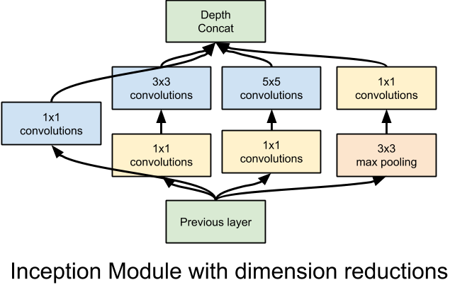
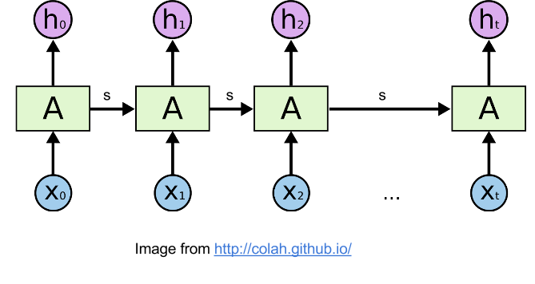

# Pretty Tensor - Fluent Neural Networks in TensorFlow

Pretty Tensor provides a high level builder API for TensorFlow. It provides
thin wrappers on Tensors so that you can easily build multi-layer neural
networks.

Pretty Tensor provides a set of objects that behave likes Tensors, but also
support a chainable object syntax to quickly define neural networks
and other layered architectures in TensorFlow.

    result = (pretty_tensor.wrap(input_data, m)
              .flatten()
              .fully_connected(200, activation_fn=tf.nn.relu)
              .fully_connected(10, activation_fn=None)
              .softmax(labels, name=softmax_name))

Please look here for full documentation of the PrettyTensor object for all
available operations:
[Available Operations](docs/PrettyTensor.md) or you can check out the [complete
documentation](docs/pretty_tensor_top_level.md)

See the tutorial directory for samples:
[tutorial/](prettytensor/tutorial/)

## Installation

The easiest installation is just to use pip:

1. Follow the instructions at
    [tensorflow.org](https://www.tensorflow.org/versions/master/get_started/os_setup.html#pip_install)
2. `pip install prettytensor`

**Note:** Head is tested against the TensorFlow nightly builds and pip is tested against TensorFlow release.

## Quick start

### Imports
    import prettytensor as pt
    import tensorflow as tf

### Setup your input
    my_inputs = # numpy array of shape (BATCHES, BATCH_SIZE, DATA_SIZE)
    my_labels = # numpy array of shape (BATCHES, BATCH_SIZE, CLASSES)
    input_tensor = tf.placeholder(np.float32, shape=(BATCH_SIZE, DATA_SIZE))
    label_tensor = tf.placeholder(np.float32, shape=(BATCH_SIZE, CLASSES))
    pretty_input = pt.wrap(input_tensor)

### Define your model
    softmax, loss = (pretty_input.
                     fully_connected(100).
                     softmax_classifier(CLASSES, labels=label_tensor))

### Train and evaluate
    accuracy = softmax.evaluate_classifier(label_tensor)

    optimizer = tf.train.GradientDescentOptimizer(0.1)  # learning rate
    train_op = pt.apply_optimizer(optimizer, losses=[loss])

    init_op = tf.initialize_all_variables()

    with tf.Session() as sess:
        sess.run(init_op)
        for inp, label in zip(my_inputs, my_labels):
            unused_loss_value, accuracy_value = sess.run([loss, accuracy],
                                     {input_tensor: inp, label_tensor: label})
            print 'Accuracy: %g' % accuracy_value

## Features

### Thin

#### Full power of TensorFlow is easy to use

Pretty Tensors can be used (almost) everywhere that a tensor can.  Just call
`pt.wrap` to make a tensor pretty.

You can also add any existing TensorFlow function to the chain using `apply`.
`apply` applies the current Tensor as the first argument and takes all the other
arguments as normal.

*Note:* because apply is so generic, Pretty Tensor doesn't try to wrap the
world.

#### Plays well with other libraries

It also uses standard TensorFlow idioms so that it plays well with other
libraries, this means that you can use it a little bit in a model or throughout.
Just make sure to run the update_ops on each training set
(see [with_update_ops](docs/pretty_tensor_top_level.md#with_update_ops)).

### Terse

You've already seen how a Pretty Tensor is chainable and you may have noticed
that it takes care of handling the input shape.  One other feature worth noting
are defaults.  Using defaults you can specify reused values in a single place
without having to repeat yourself.

    with pt.defaults_scope(activation_fn=tf.nn.relu):
      hidden_output2 = (pretty_images.flatten()
                       .fully_connected(100)
                       .fully_connected(100))

Check out the documentation to see
[all supported defaults](docs/pretty_tensor_top_level.md#defaults_scope).

### Code matches model

Sequential mode lets you break model construction across lines and provides
the subdivide syntactic sugar that makes it easy to define and understand
complex structures like an [inception module](http://arxiv.org/abs/1409.4842):

    with pretty_tensor.defaults_scope(activation_fn=tf.nn.relu):
      seq = pretty_input.sequential()
      with seq.subdivide(4) as towers:
        towers[0].conv2d(1, 64)
        towers[1].conv2d(1, 112).conv2d(3, 224)
        towers[2].conv2d(1, 32).conv2d(5, 64)
        towers[3].max_pool(2, 3).conv2d(1, 32)

Templates provide guaranteed parameter reuse and make unrolling recurrent
networks easy:

    output = [], s = tf.zeros([BATCH, 256 * 2])

    A = (pretty_tensor.template('x')
         .lstm_cell(num_units=256, state=UnboundVariable('state'))

    for x in pretty_input_array:
      h, s = A.construct(x=x, state=s)
      output.append(h)

There are also some convenient shorthands for LSTMs and GRUs:

    pretty_input_array.sequence_lstm(num_units=256)

### Extensible

You can call any existing operation by using `apply` and it will simply
subsitute the current tensor for the first argument.

    pretty_input.apply(tf.mul, 5)

You can also create a new operation  There are two supported registration
mechanisms to add your own functions. `@Register()` allows you to create a
method on PrettyTensor that operates on the Tensors and returns either a loss or
a new value. Name scoping and variable scoping are handled by the framework.

The following method adds the leaky_relu method to every Pretty Tensor:

    @pt.Register
    def leaky_relu(input_pt):
      return tf.select(tf.greater(input_pt, 0.0), input_pt, 0.01 * input_pt)

`@RegisterCompoundOp()` is like adding a macro, it is designed to group together
common sets of operations.

### Safe variable reuse

Within a graph, you can reuse variables by using templates.  A template is
just like a regular graph except that some variables are left unbound.

See more details in [PrettyTensor class](docs/PrettyTensor.md).

### Accessing Variables

Pretty Tensor uses the standard graph collections from TensorFlow to store variables.  These can be accessed using `tf.get_collection(key)` with the following keys:

* `tf.GraphKeys.VARIABLES`: all variables that should be saved (including some statistics).
* `tf.GraphKeys.TRAINABLE_VARIABLES: all variables that can be trained (including those before a `stop_gradients` call). These are what would typically be called *parameters* of the model in ML parlance.
* `pt.GraphKeys.TEST_VARIABLES`: variables used to evaluate a model. These are typically not saved and are reset by the LocalRunner.evaluate method to get a fresh evaluation.

## Authors

Eider Moore (eiderman)

with key contributions from:

* Hubert Eichner
* Oliver Lange
* Sagar Jain (sagarjn)
